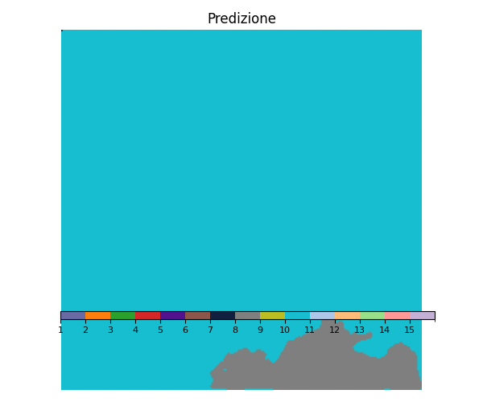

# Unet for detecting marine pollutants and sea surface features on MADOS dataset

 Questo progetto utilizza l'architettura U-Net, una rete neurale convoluzionale basata su encoder-decoder, per il rilevamento e la segmentazione di inquinanti marini (chiazze di petrolio, rifiuti marini) e caratteristiche fisiche della superficie del mare (es. navi, onde, piattaforme petrolifere, diverse condizioni in cui l'acqua si può presentare ) sfruttando il dataset MADOS (Marine Debris Observation Satellite) consultabile al seguente link: https://marine-pollution.github.io/.

1.  Marine Debris

2. Dense Sargassum

3. Sparse Floating Algae

4. Natural Organic Material

5. Ship

6. Oil Spill

7. Marine Water

8. Sediment-Laden Water

9. Foam

10.   Turbid Water

11.  Shallow Water

12.  Waves & Wakes

13.  Oil Platform

14.  Jellyfish

15.  Sea snot

# Prediction sul test set del miglior modello
Di seguito vengono riportate le prediction calcolate sul modello che riporta metriche migliori (Modello 4) sopratutto per classi ritenute  importanti per lo scopo del progetto quali Marine Debris, Oil Spill e Oil Platform

   
 

   

   

   

   

   

   

   

